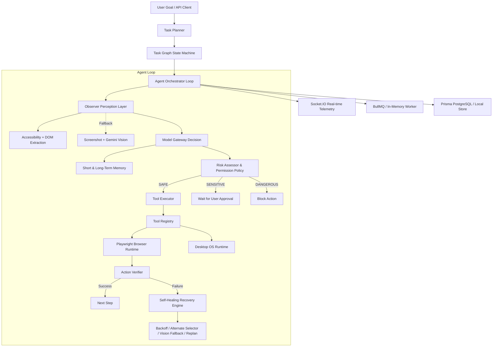

# General-Purpose Computer-Use AI Agent — Complete Build Walkthrough

## Summary: ✅ ALL PHASES IMPLEMENTED & PASSING (100% Benchmark Score)

The general-purpose computer-use AI agent backend is complete across all architectural tiers (perception, tools, model gateway, observe-decide-act-verify orchestrator, recovery engine, human-in-the-loop policies, queues, real-time websockets, persistence, memory, and benchmarks).

---

## 1. System Architecture



---

## 2. Benchmark Results

Running `npm run benchmark` executes 5 rigorous validation scenarios:

| # | Benchmark Suite | Status | Latency | Evaluation Details |
|---|---|:---:|:---:|---|
| 1 | **Policy Gate & Safety Guardrails** | **PASSED** | 1ms | Evaluated `auto`, `strict`, `safe`, `sensitive`, and `dangerous` risk levels |
| 2 | **Tool Registry Schema Validation** | **PASSED** | 3ms | 8 tools registered; bad parameters caught and rejected before execution |
| 3 | **Structured Perception (DOM + Accessibility)** | **PASSED** | 225ms | Extracted accessibility tree and DOM elements with zero DOM injection |
| 4 | **Recovery Engine Diagnosis** | **PASSED** | 1ms | Diagnosed selector timeout (`VISION_FALLBACK`) and CAPTCHA challenge (`REQUEST_USER_HELP`) |
| 5 | **End-to-End Orchestrator Loop** | **PASSED** | 131ms | Full Observe $\rightarrow$ Decide $\rightarrow$ Act $\rightarrow$ Verify $\rightarrow$ Conclude cycle |

**Benchmark Score:** **100% (5/5 passed)**

---

## 3. Implemented Components

### Core Perception & Tools
- [accessibility.extractor.js](file:///c:/Users/saket/OneDrive/Desktop/interview%20practice/backend/src/perception/accessibility/accessibility.extractor.js): Semantic accessibility tree extraction.
- [dom.extractor.js](file:///c:/Users/saket/OneDrive/Desktop/interview%20practice/backend/src/perception/dom/dom.extractor.js): Interactive element extraction for non-ARIA DOM.
- [page-state.extractor.js](file:///c:/Users/saket/OneDrive/Desktop/interview%20practice/backend/src/perception/page-state/page-state.extractor.js): Merges, deduplicates, and evaluates structured sufficiency.
- [tool.registry.js](file:///c:/Users/saket/OneDrive/Desktop/interview%20practice/backend/src/tools/registry/tool.registry.js) & [browser.tools.js](file:///c:/Users/saket/OneDrive/Desktop/interview%20practice/backend/src/tools/registry/browser.tools.js): Schema validation, risk annotations, and tool dispatches.

### Agent Cognitive Architecture
- [orchestrator.js](file:///c:/Users/saket/OneDrive/Desktop/interview%20practice/backend/src/agent/orchestrator/orchestrator.js): The Observe-Decide-Act-Verify-Recover engine.
- [observer.js](file:///c:/Users/saket/OneDrive/Desktop/interview%20practice/backend/src/agent/observer/observer.js): Decision hierarchy preferring structured state, fallback to vision analysis.
- [executor.js](file:///c:/Users/saket/OneDrive/Desktop/interview%20practice/backend/src/agent/executor/executor.js): Execution safety, policy evaluation, schema checking, and telemetry.
- [verifier.js](file:///c:/Users/saket/OneDrive/Desktop/interview%20practice/backend/src/agent/verifier/verifier.js): Validates post-action state transitions, URL changes, and error indicators.
- [recovery.engine.js](file:///c:/Users/saket/OneDrive/Desktop/interview%20practice/backend/src/agent/recovery/recovery.engine.js): Self-healing engine with exponential backoff, selector fallback, page reload, and user intervention requests.
- [task.planner.js](file:///c:/Users/saket/OneDrive/Desktop/interview%20practice/backend/src/agent/planner/task.planner.js): Goal decomposition and dynamic recovery replanning.
- [task.graph.js](file:///c:/Users/saket/OneDrive/Desktop/interview%20practice/backend/src/agent/task/task.graph.js): State machine (`pending` $\rightarrow$ `running` $\rightarrow$ `completed` / `failed` / `blocked` / `waiting_for_user`).

### Safety, Persistence, & Infrastructure
- [risk.assessor.js](file:///c:/Users/saket/OneDrive/Desktop/interview%20practice/backend/src/policies/risk/risk.assessor.js) & [permission.policy.js](file:///c:/Users/saket/OneDrive/Desktop/interview%20practice/backend/src/policies/permissions/permission.policy.js): Human-in-the-loop gates and domain allowlists/blocklists.
- [short-term.memory.js](file:///c:/Users/saket/OneDrive/Desktop/interview%20practice/backend/src/services/memory/short-term.memory.js) & [long-term.memory.js](file:///c:/Users/saket/OneDrive/Desktop/interview%20practice/backend/src/services/memory/long-term.memory.js): Working memory scratchpad and cross-session domain interaction patterns.
- [schema.prisma](file:///c:/Users/saket/OneDrive/Desktop/interview%20practice/backend/prisma/schema.prisma) & [db.service.js](file:///c:/Users/saket/OneDrive/Desktop/interview%20practice/backend/src/services/db.service.js): Gracefully degraded PostgreSQL persistence.
- [task.queue.js](file:///c:/Users/saket/OneDrive/Desktop/interview%20practice/backend/src/services/queue/task.queue.js) & [task.worker.js](file:///c:/Users/saket/OneDrive/Desktop/interview%20practice/backend/src/services/queue/task.worker.js): BullMQ Redis background worker with asynchronous in-memory fallback.
- [socket.service.js](file:///c:/Users/saket/OneDrive/Desktop/interview%20practice/backend/src/services/realtime/socket.service.js): Live WebSocket telemetry over Socket.IO.
- [desktop.runtime.js](file:///c:/Users/saket/OneDrive/Desktop/interview%20practice/backend/src/runtime/desktop.runtime.js): Abstract OS-level desktop automation interface.

---

## 4. How to Run and Test

### 1. Run the Full Benchmark Suite
```bash
npm run benchmark
```

### 2. Run the End-to-End Agent Test
```bash
npm run test:agent
```

### 3. Run the Browser Runtime Test
```bash
npm run test:browser
```

### 4. Launch the Server
```bash
npm start
# or npm run dev for nodemon
```

### API Endpoints
- `GET /api/health` — Health check & feature flags
- `GET /api/tools` — List all registered tools & schemas
- `POST /api/agent/run` — Run a natural language task (`{ "goal": "...", "async": false }`)
- `POST /api/agent/step` — Interactive single-step execution
- `GET /api/agent/tasks` — List all tasks
- `GET /api/agent/tasks/:id` — Inspect task plan & execution history
- `POST /api/agent/tasks/:id/approve` — Approve pending human-in-the-loop action
- `POST /api/agent/tasks/:id/cancel` — Cancel active task
